<!-- TRAVEL: replace the image, location, and short reflection with your own. -->

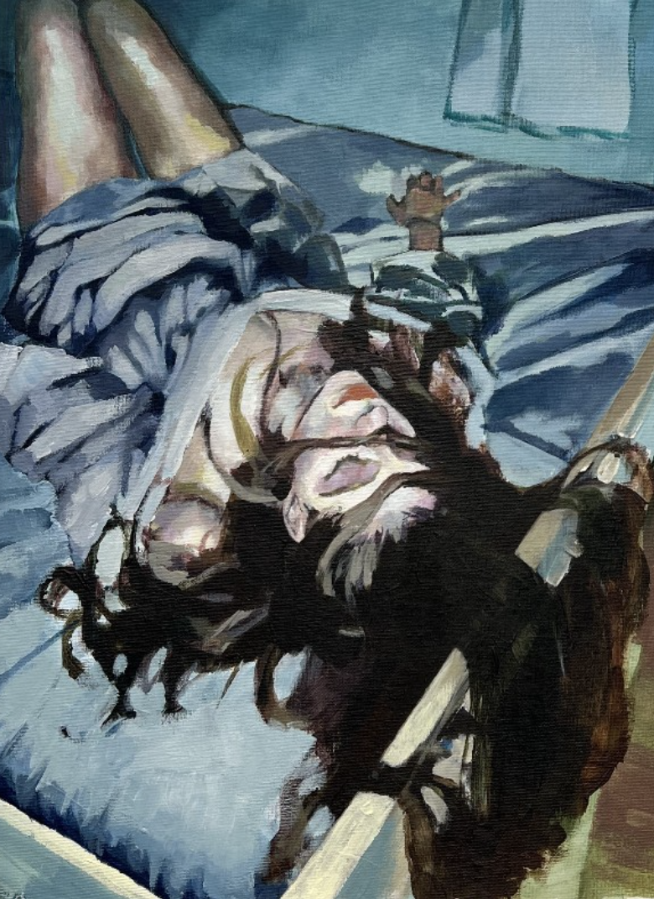{.featured-photo fig-alt="Woman laying on bed"}

## *Blue All the Time*

[Acrylic on Canvas, 2023]{.project-label}

I made this piece when I was spending a lot of time in my room and I felt almost like I was becoming one with my bed. It's not a self portrait but it represents the feeling I had of being trapped yet refusing to leave my place of comfort. 

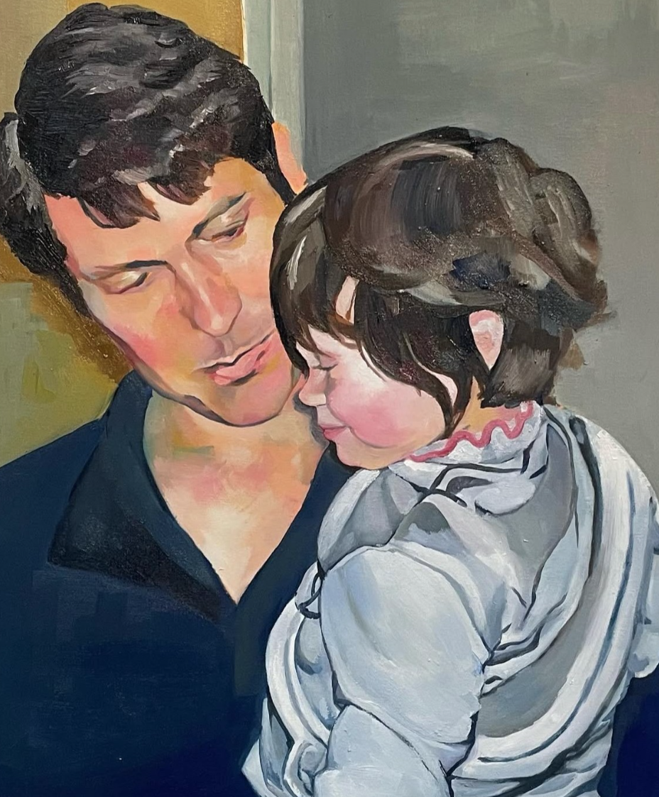{.featured-photo fig-alt="dad"}

## *Good Parenting*

[Oil on Canvas, 2024]{.project-label}

I made this piece to express my gratitude for my dad. My dad has supported me in all my pursuits even when I have stumbled or changed direction. Despite living in a different state than me for most of my life, he has always made every effort to be there for me. He moved in the first place to take a higher paying job and secure a good education for my brother and I. While applying to colleges, I decided to pursue fine arts. I harbored a lot of guilt for wanting to follow a path with uncertain pay and limited opportunities; however, when I told my dad he encouraged me to try anyways. My dad's guidance and reassurance gave me the courage to strive for my goals. 

When it came time to put together my portfolio, I realized I was short one piece. While reflecting on my dad's role in my life and the hard work he has put into supporting our family, I was inspired me to make this painting. I named it after a song we listened to together, which he didn't like much but listened to anyways because I wanted him to hear it. The song is Heart Emoji // Good Parenting by the band Guitar Fight from Fooly Cooly.

# More Art

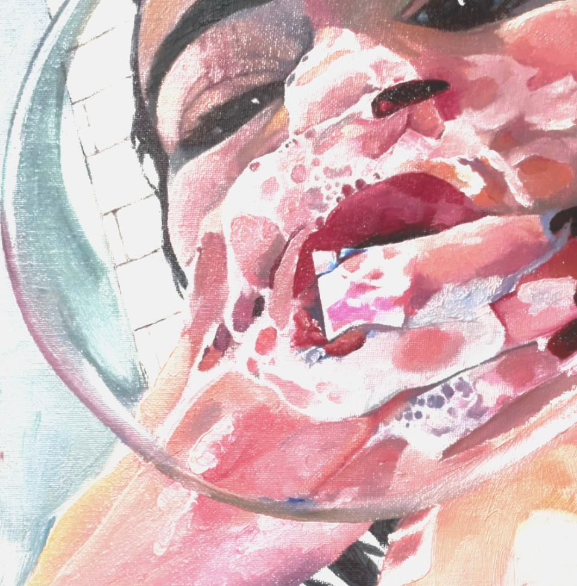{.travel-photo fig-alt="bubble"}

### *Bubble*

[Acrylic on Canvas, 2023]{.project-label}

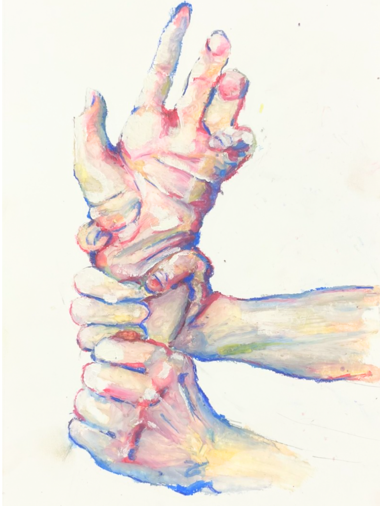{.travel-photo fig-alt="Hands"}

### *Malleable*

[Oil Pastel on Paper, 2022]{.project-label}

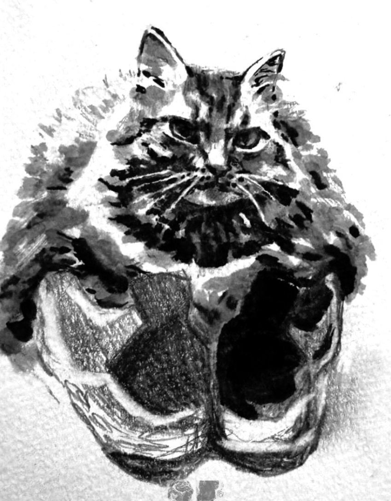{.travel-photo fig-alt="kiki"}

### *Kiki*

[Ink and Graphite on Paper, 2024]{.project-label}

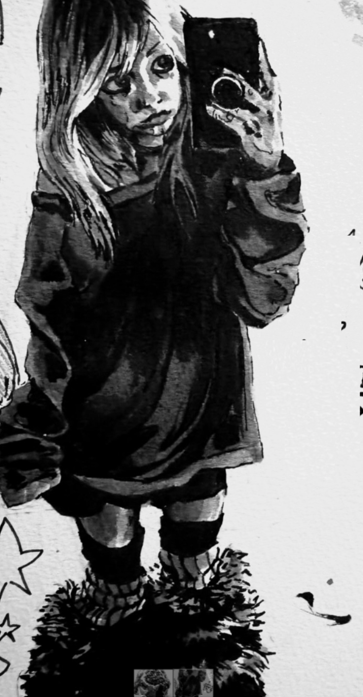{.travel-photo fig-alt="mirror"}

### Ink Study

[Ink and Graphite on Paper, 2024]{.project-label}

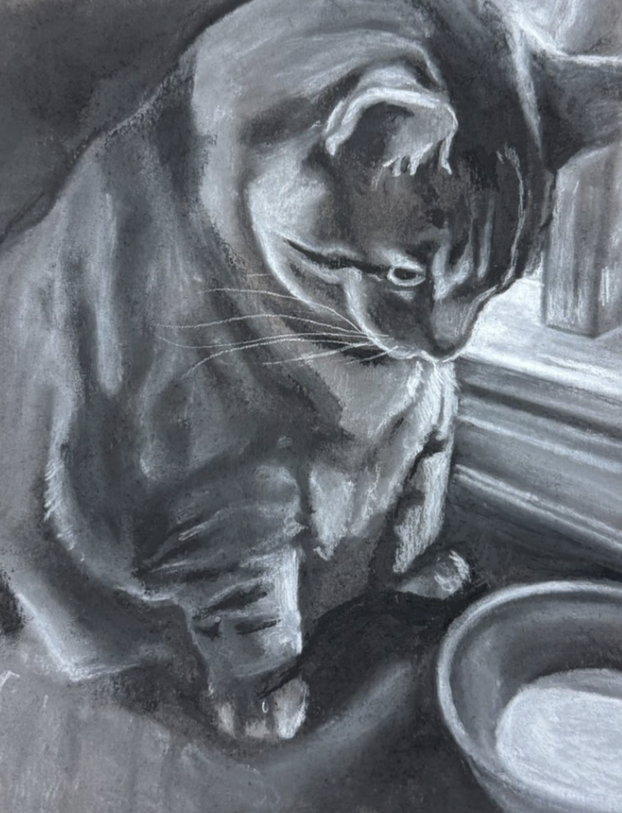{.travel-photo fig-alt="cookie"}

### *Cookie & Milk* 

[Charcoal on Paper, 2025]{.project-label}

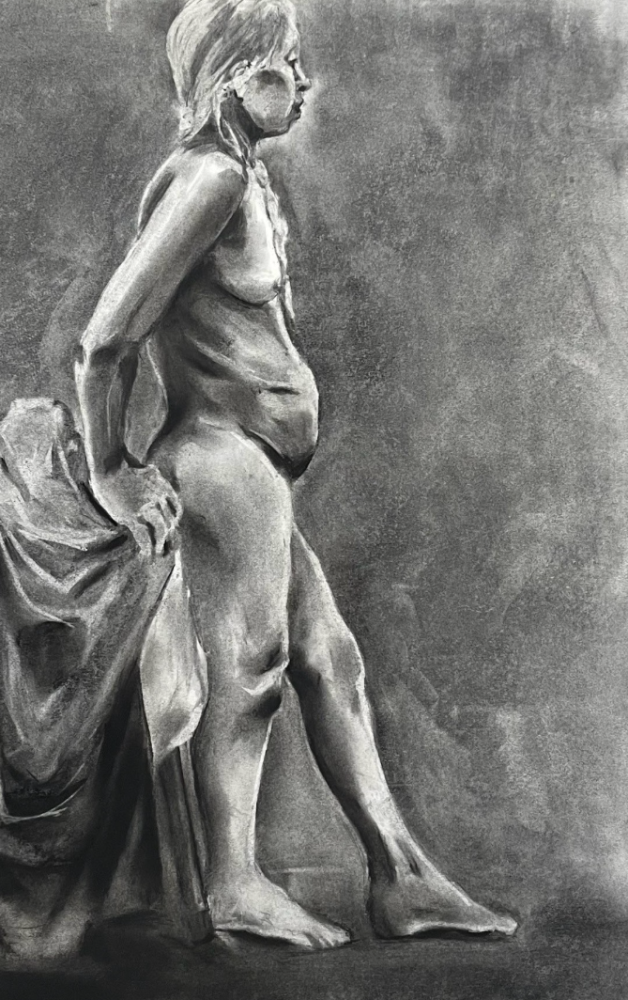{.travel-photo fig-alt="life"}

### Figure Drawing Study

[Charcoal on Paper, 2023]{.project-label}

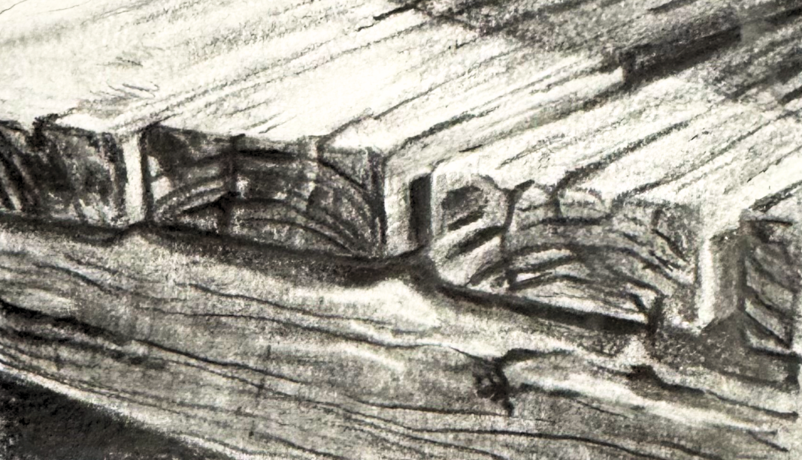{.travel-photo fig-alt="wood"}

### Wooden Texture Study

[Graphite on Paper, 2023]{.project-label}

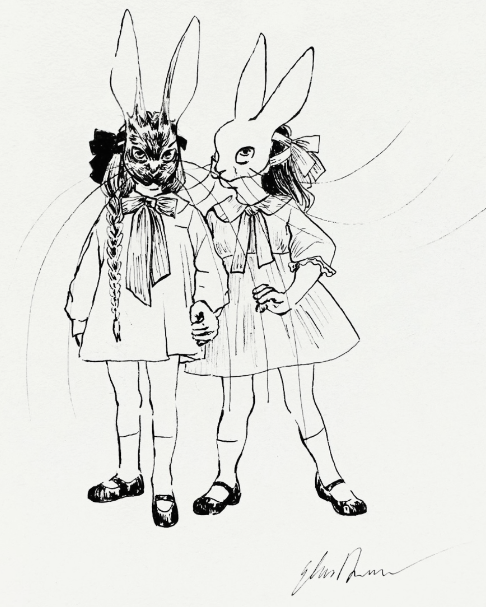{.travel-photo fig-alt="bunnies"}

### *Strength in Numbers*

[Ink on Paper, 2023]{.project-label}

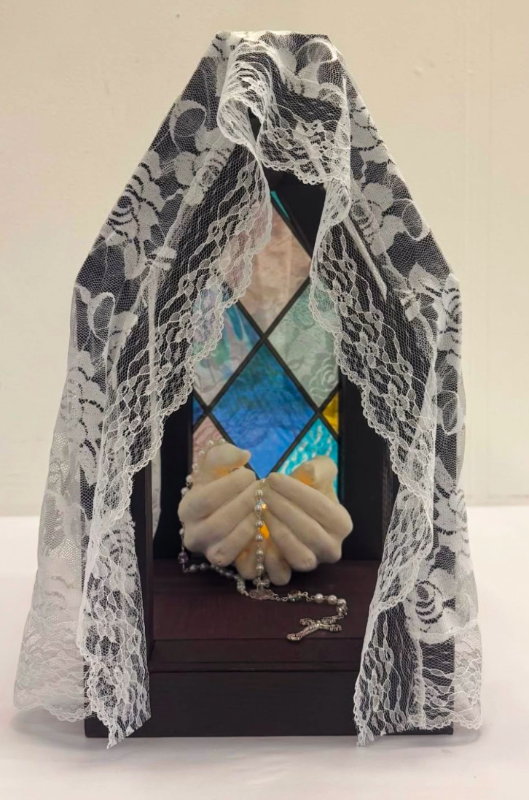{.travel-photo fig-alt="Sculpture"}

### *I Wish I Felt It*

[Plaster Sculpture in Wooden and Plastic Frame, 2025]{.project-label}

<!-- Add another place by copying the image and heading pattern above. -->

[FUll Gallery](https://www.instagram.com/edow.art?utm_source=ig_web_button_share_sheet&stkn=ZDNlZDc0MzIxNw==)
